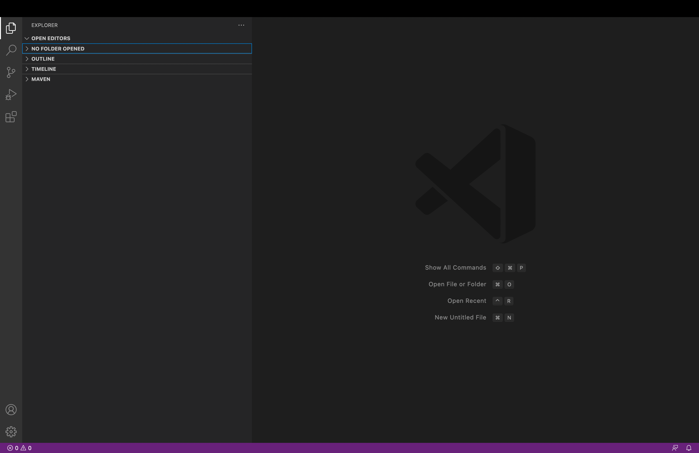
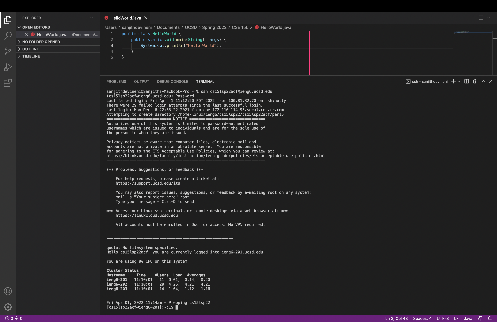
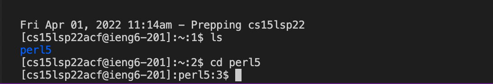
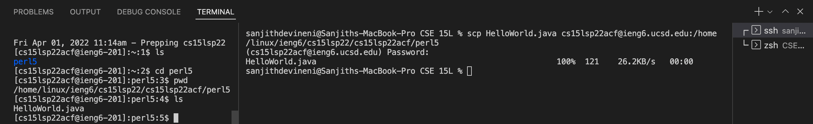
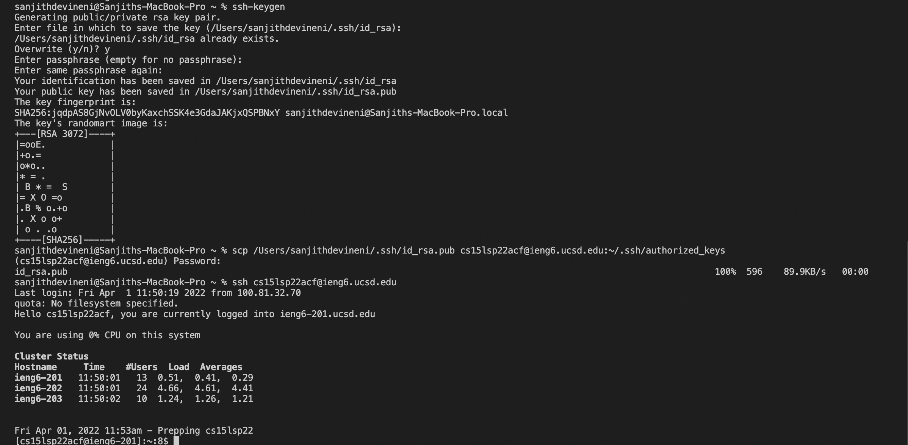
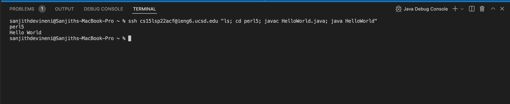

# **Lab 1 Report - Week 2**

## **Installing VSCode**

To install VSCode, I went to this [link](https://code.visualstudio.com/Download#) and downloaded VSCode. After downloading it, I opened it and the interface looked something like this:




## **Remotely Connecting**

For remote connection, I used the `ssh` command which stands for secure shell. The line in the terminal was:

```
ssh cs15lsp22acf@ieng6.ucsd.edu
```

In this, the *cs15lsp22acf* part is my username for the CSE 15L class. The remote server is *ieng6.ucsd.edu*. I entered the line in the terminal and it prompted me for my password, for which i entered it and I was able to log in to the server. Doing this can be seen in the image below. 



## **Trying Some Commands**

Once I logged into my account in the remote server, I used a command called `ls` which means list files and it lists all existing files in the directory you are in. You can try other commands as well such as `pwd` which means print working directory, or `cd` which means change directory. In the image below, it can be seen that I used `ls` and the existing files (only perl5) was listed. Then I used `cd perl5` to change the directory and enter the perl5 folder thereby entering that directory.



## **Moving Files with scp**

It is possible to move files from your own computer to the remote server using the `scp` command. This command stands for secure copy. In the terminal of my own computer, I typed the line:

```
scp HelloWorld.java cs15lsp22acf@ieng6.ucsd.edu:/home/linux/ieng6/cs15lsp22/cs15lsp22acf/perl5
```

After hitting enter, the terminal prompted me for the password, and after I typed it the file was moved and this can be assured by the 100% on the right. MOving on, if we go back to the remote server, and we type `ls`, we can see the file there. The directory for the remote server can be obtained by using `pwd` in the remote server. 



## **Setting an SSH Key**

To set up an SSH Key we use the command `ssh-keygen` which generates a public/private rsa key pair. You can choose a passphrase or leave it empty if you wish. In this case, I left it empty as it would lead to quicker log in to the server. Then I type the command:

```
scp /Users/sanjithdevineni/.ssh/id_rsa.pubcs15lsp22acf@ieng6.ucsd.edu:~/.ssh/authorized_keys
```

This securely copies the public key from my computer to the remote server, which then allows me to login to my account on the server using my passphrase, which is empty, and it therefore automatically logs me in. This leads to a faster process. 



## **Optimizing Remote Key**

Next, to make remote running even more pleasant and quick, we can use different actions in the terminal. The up arrow goes to the last command used. Here, I used the line:

```
ssh cs15lsp22acf@ieng6.ucsd.edu "ls; cd perl5; javac HelloWorld.java; java HelloWorld"
```

We can see from this, that we can run multiple commands in one line using semicolons. Also putting commands in quotes at the end of `ssh` commands runs the commands on the remote server, and then exits. It is a simple, easy and fast way to perform operations in the remote server. 



## That was my Lab 1 Report. Thank You!