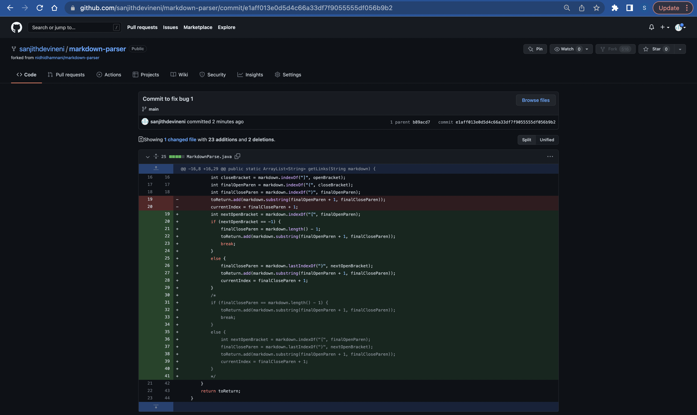

# **Lab Report 2 - Week 4**

## **Change 1**

Code Change 1:

Test File Link:

[TestFile1Link](test-file2.md)

Symptom:

The failure-inducing input here is the link which contains "(" and ")" within the link. This causes the while loop to continue forever until the storage space to run out. Because after the close parentheses, the program searches for another open braket, but since it cannot find one, it returns -1 and the search begins from there again, so the while loop never ends. The failure-inducing input here is the parentheses within the link. The symptom is the code running infinitely and running out of heap space. The bug is the while loop that runs infinitely because the code cannot find another open bracket and returns -1.

## **Change 2**

Code Change 2:

Test File Link:

[TestFile2Link](test-file3.md)

Symptom:

The failure induding input here is the fact that the file contains no links. This causes the code to output incorrect data. The data is outputs should be an empty list, but the program takes almost the entire string and outputs it. This is caused because the code cannot find any brackets or parentheses, and the implementation of the program causes it to output the substring from index 0 to the length-1. The failure-inducing input here is the file with no links. The symptom here is the incorrect output. The bug is the code not checking if there is no open braket to handle this case.

## **Change 3**

Code Change 3:

Test File Link:

[TestFile3Link](test-file4.md)

Symptom:

The failure inducing input here is the existence of an image which also has a similar format to a link but with an ! before the open bracket. This caused the code to output incorrectly since it added the image's name into the list. This happened because the program was not aware that the image was an image and considered it a link. The failure inducing input here is the image. The symptom is the incorrect output. The bug is the code not checking if there is an exclamation mark before the open bracket to handle this case.  