# **Lab Report 3 - Week 6**

## **Streamlining `ssh` Configuration**

How I created and edited the `.ssh/config` file:

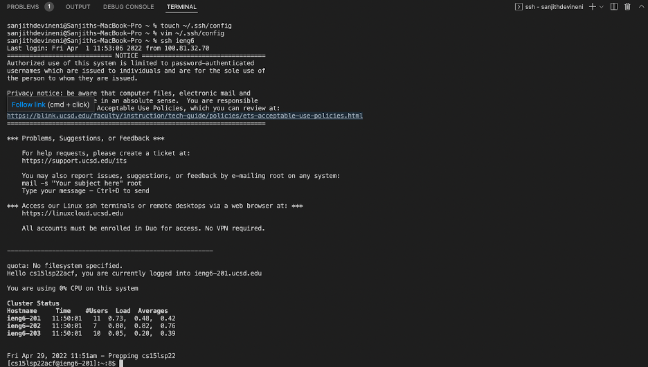

Contents of `.ssh/config`:

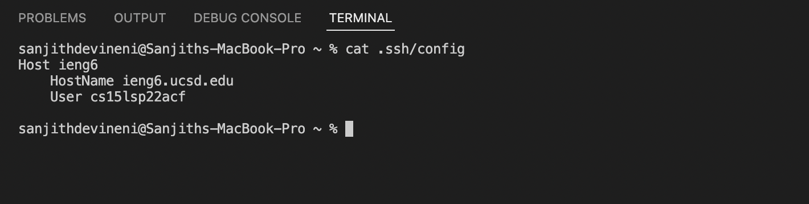

`ssh` command logging into account using alias:

`scp` using an alias:

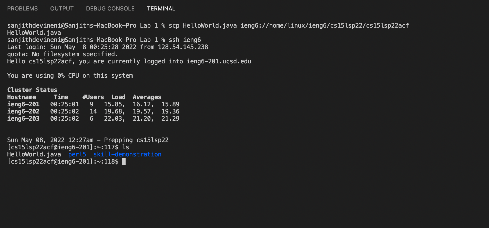

## **Setup Github Access from ieng6**

Public key stored on Github:

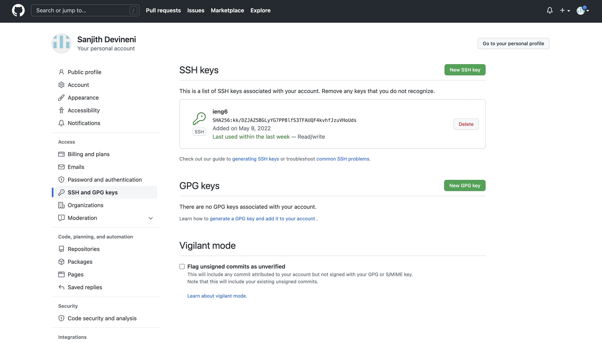

Public key you stored in your user account:

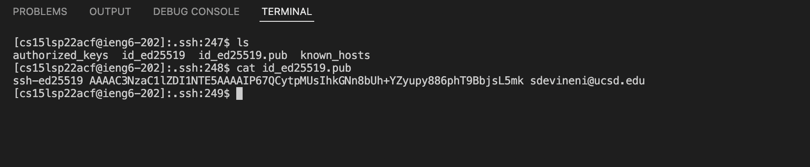

Private key on user account:

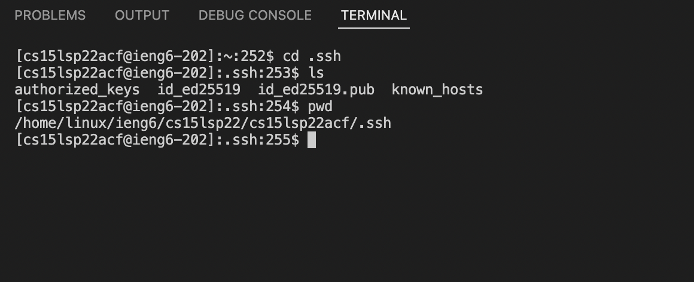

Running `git` commands to commit and push a change to Github while logged into ieng6 account:

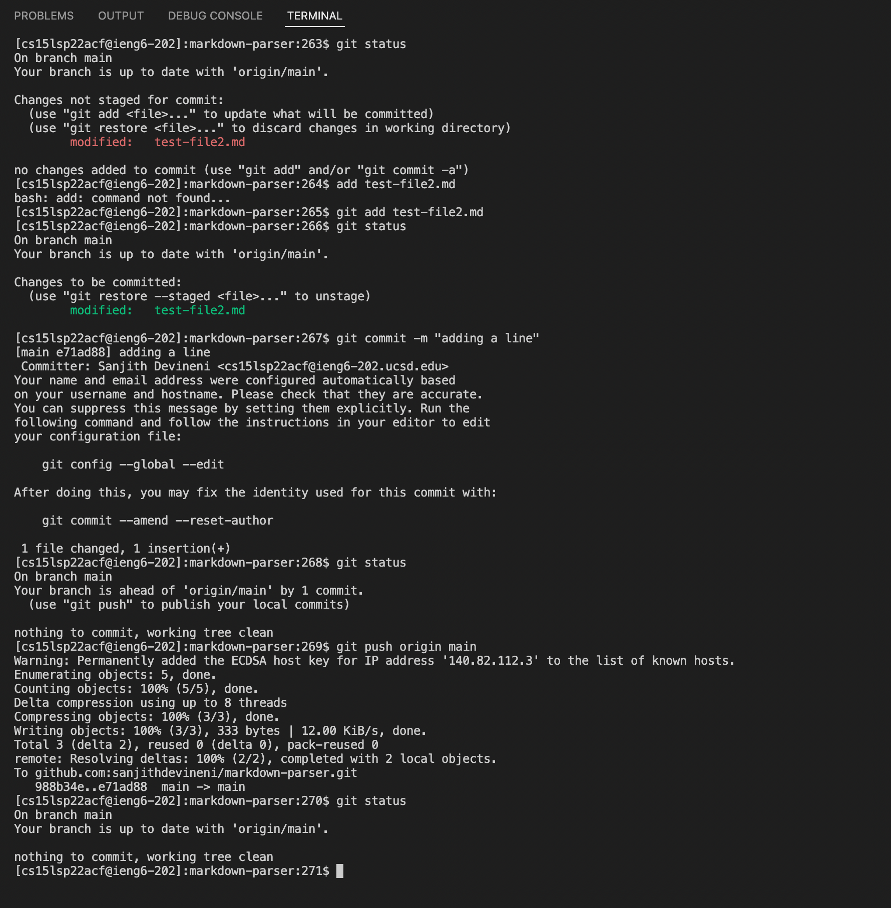

Link for resulting commit:

[LinkForCommit](https://github.com/sanjithdevineni/markdown-parser/commit/e71ad887ff60f771de1c331d7c1023d6305e0d24)

## **Copy whole directories with `scp -r`**

Copying whole markdown-parse directory to ieng6 account:

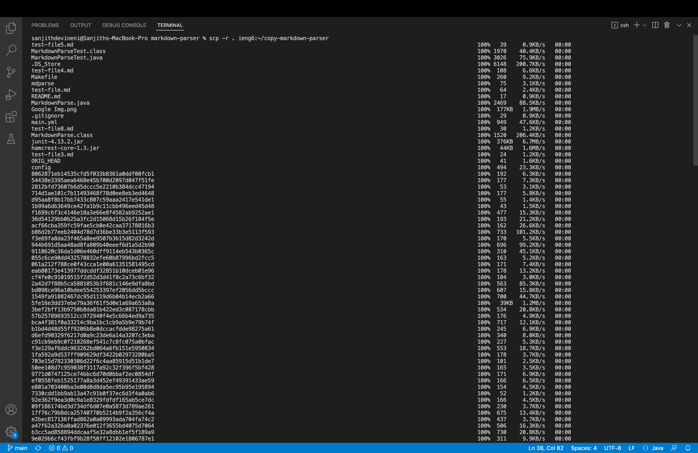

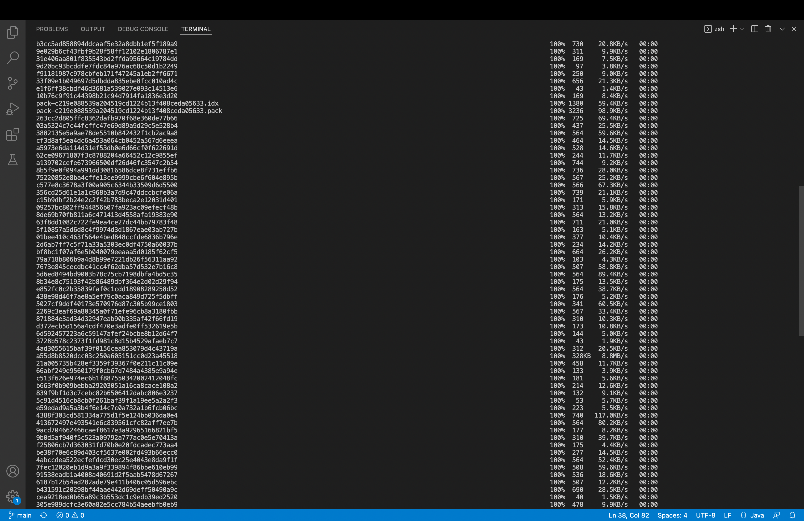

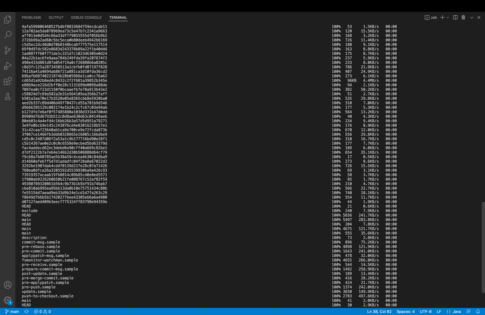

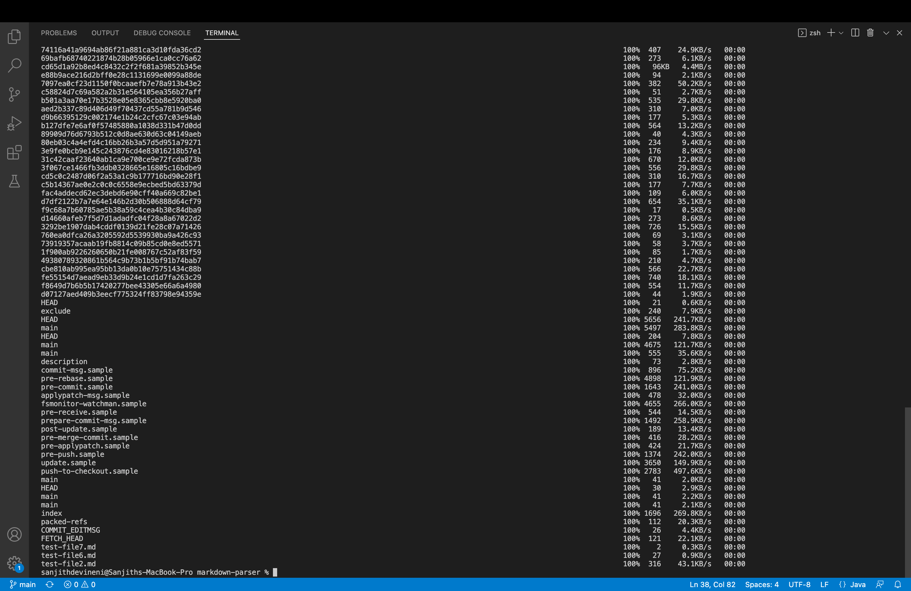

Logging into ieng6 account and compiling and running the tests for repository:

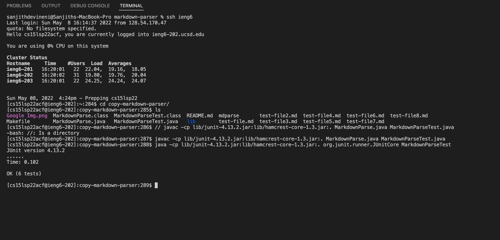

Combining `scp`, `;`, and `ssh` to copy the whole directory and run the tests in one line:

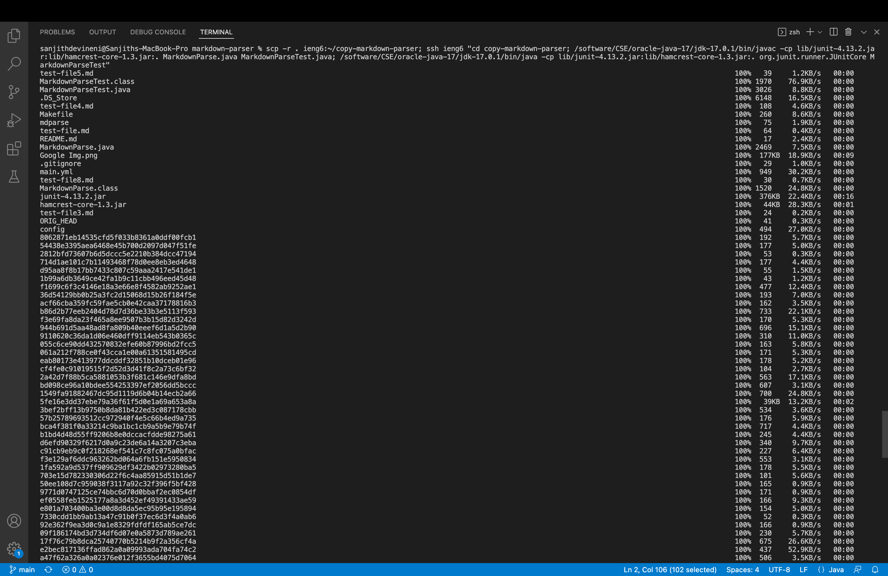

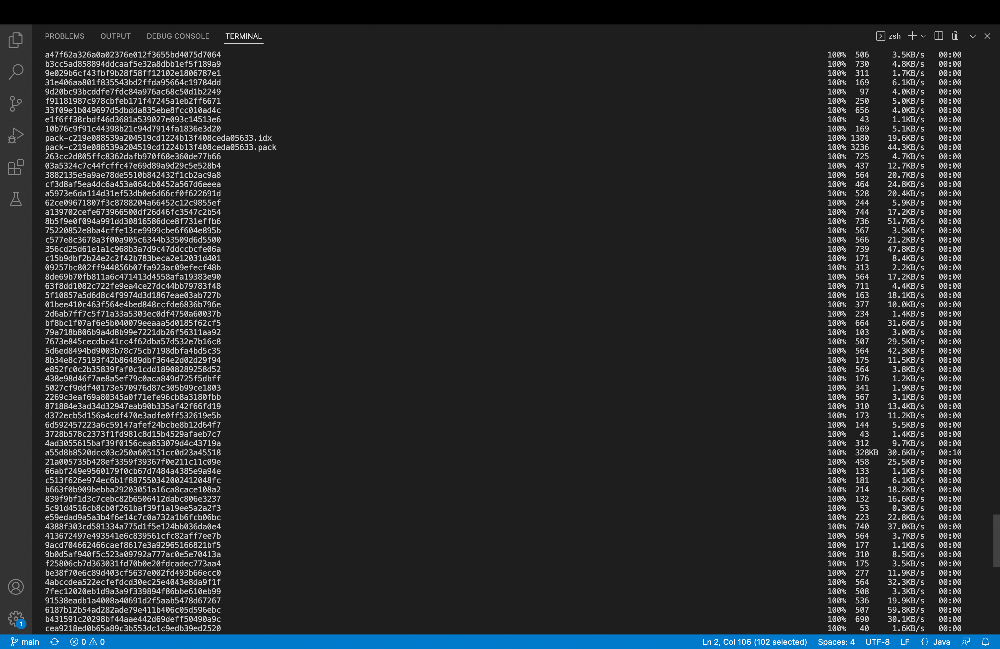

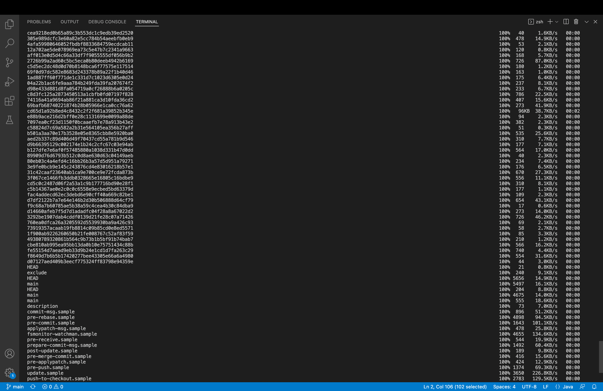

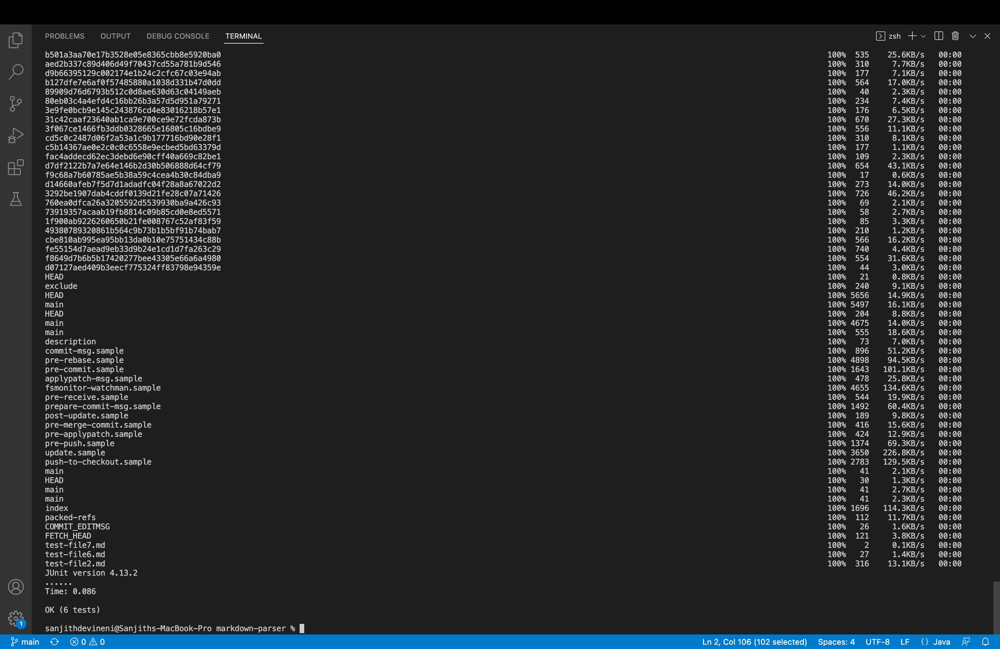