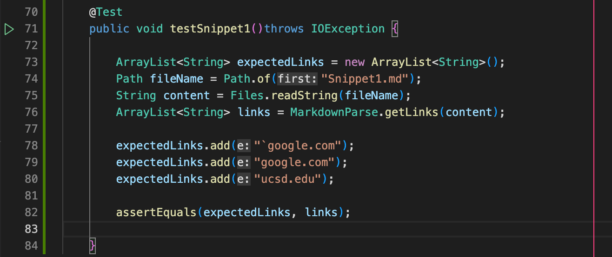
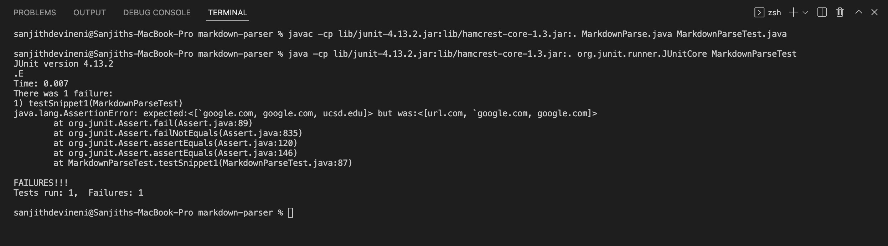
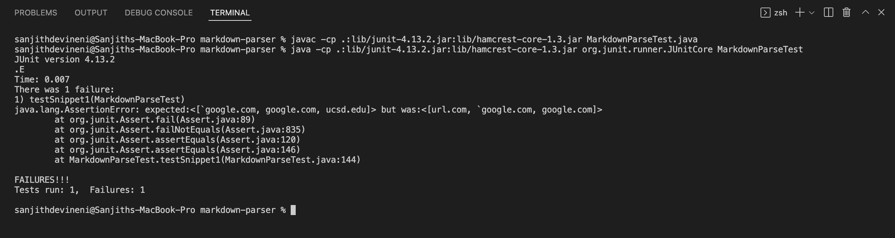
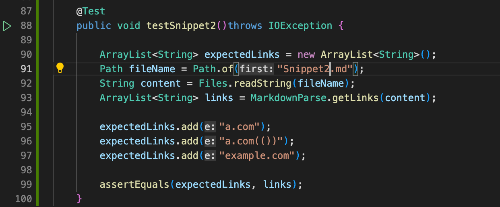
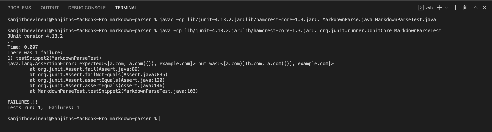
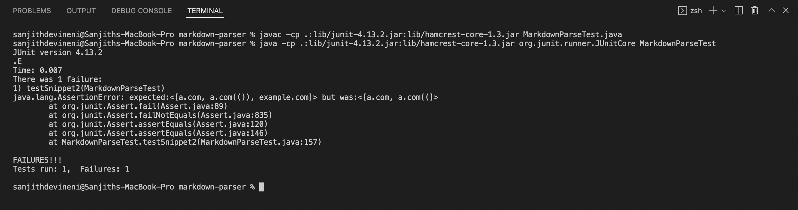
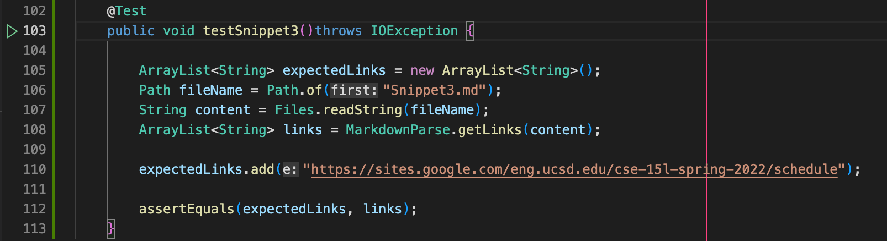
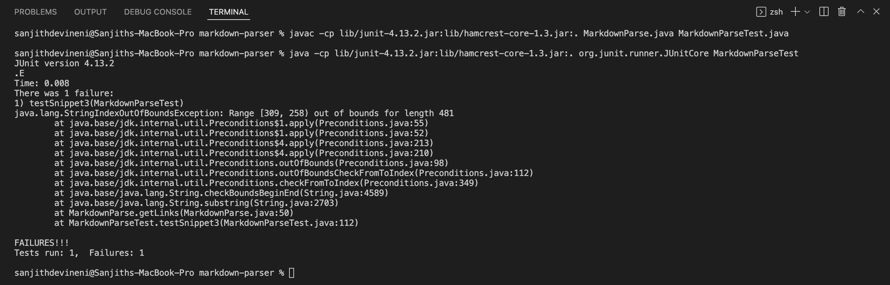
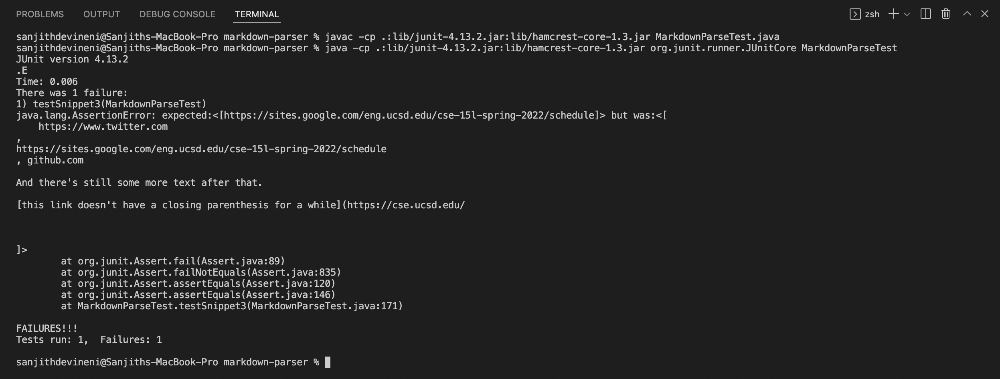

# **Lab Report 4 - Week 8**

Link to my markdown-parse repository:

[MyMarkdownParse](https://github.com/sanjithdevineni/markdown-parser)

Link to other markdown-parse repository:

[OtherMarkdownParse](https://github.com/lithicarus/markdown-parser)

## Snippet 1

Code in `MarkdownParseTest.java` file:

Result of running test with my implementation of `MarkdownParse.java`:

The test did not pass.

Result of running test with other's implementation of `MarkdownParse.java`:

The test did not pass.

Q) Do you think there is a small (<10 lines) code change that will make your program work for snippet 1 and all related cases that use inline code with backticks? If yes, describe the code change. If not, describe why it would be a more involved change.

Ans.

Yes, I think there is a small (<10 lines) code change that will make my program work for snippet 1 and all related cases that use inline code with backticks. The code change would involve checking if the open bracket succeeds of comes after a backtick. If that is the case, then we would search for the next open bracket and continue from there. Another code change would involve checking if there exists a another close bracket after a close bracket which doesn't have an open parenthsis after it. We would take that close bracket and open parenthesis in that case.

## Snippet 2

Code in `MarkdownParseTest.java` file:

Result of running test with my implementation of `MarkdownParse.java`:

The test did not pass.

Result of running test with other's implementation of `MarkdownParse.java`:

The test did not pass.

Q) Do you think there is a small (<10 lines) code change that will make your program work for snippet 2 and all related cases that nest parentheses, brackets, and escaped brackets? If yes, describe the code change. If not, describe why it would be a more involved change.

Ans.

Yes, I think there is a small (<10 lines) code change that will make my program work for snippet 2 and all related cases that nest parentheses, brackets, and escaped brackets. The code change would involve changing the line that causes the program to search for a close parenthesis backwards from the next open bracket. Either we would remove this line or we could check if there is a close parenthesis between the close parenthesis stored and the next open bracket and disregard this. We could only use the close parenthesis found backwards from the next open bracket if there was a parenthesis in the link itself.

## Snippet 3

Code in `MarkdownParseTest.java` file:

Result of running test with my implementation of `MarkdownParse.java`:

The test did not pass.

Result of running test with other's implementation of `MarkdownParse.java`:

The test did not pass.

Q) Do you think there is a small (<10 lines) code change that will make your program work for snippet 3 and all related cases that have newlines in brackets and parentheses? If yes, describe the code change. If not, describe why it would be a more involved change.

Ans.

Yes, I think there is a small (<10 lines) code change that will make my program work for snippet 3 and all related cases that have newlines in brackets and parentheses. We would have to search for a newline character within the code and if it is between the brackets or parentheses, then it is invalid. We would also have to search for a close parenthesis between the open parethesis and the next open bracket, and if there doesn't exist one, we would contine the program with the next open bracket. I am unsure if this code change would be less than 10 lines of code, but from my understanding it would be. However, to be sure, I would have to implement the code change practically.