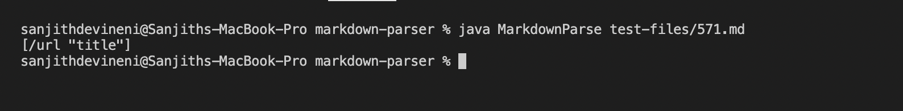

# **Lab Report 5 - Week 10**

I found the tests with different results using `vimdiff` on the results of running a bash for loop. 

I ran the command:

```
$ vimdiff results.txt resultsOther.txt
```

## Test 1:

481.md

[Test1Link](481.md)

The correct implementation for the test is my implementation of `MarkdownParse.java`.

Actual results of my implementation:


Actual Results of other implementation:


Expected Output for the test:


As can be seen from the image, the link is valid, so the expected result is:

`[/uri "title"]`

Incorrect implementation is other implementation.

Problem with implementation:

The bug in the code is the fact that the code does not accept the string in the parentheses as a link and therefore returns an empty link. It unnecessarilly checks if the potentialLink has a string in it.

Code that needs to be fixed:


The selected portion is the line that should be changed. The part that says:

```
potentialLink.indexOf(" ") == -1 &&
```
should be removed, and the correct result will be outputed.

## Test 2:

571.md

[Test2Link](571.md)

The correct implementation for the test is the other implementation of `MarkdownParse.java`.

Actual results of my implementation:



Actual Results of other implementation:


Expected Output for the test:


As can be seen from the image, the link is invalid, so the expected result is:

`[]`

Incorrect implementation is my implementation.

Problem with implementation:

The bug in the code is the fact that the code does not check if it is an image and thus accepts it as a link. It needs to check if there is an exclamation mark before the open bracket.

Code that needs to be fixed:


The selected portion is the line that should be changed. The part that says:

```
openBracket-1 > 0
```
should be changed to:

```
openBracket-1 >= 0
```

and the correct result will be outputed. The problem was that the code was never checking if there was an exclamation mark before the open bracket because it never entered the if statement.